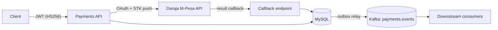

# daraja-payments

[](https://github.com/jeffgicharu/daraja-payments/actions/workflows/ci.yml)
[](LICENSE)

A payments microservice for **M-Pesa Lipa na M-Pesa Online (STK Push)**, built on the
[Safaricom Daraja API](https://developer.safaricom.co.ke). It initiates customer
payment prompts, processes Daraja's asynchronous result callbacks idempotently, and
publishes payment lifecycle events to Kafka for downstream consumers.

Built with Java 17 and Spring Boot 4, backed by MySQL and Kafka.

## Architecture



Key design decisions:

- **Idempotent webhook processing.** Daraja retries callbacks; every payload is
  recorded in an audit log, deduplicated on `CheckoutRequestID`, and a callback can
  never overwrite a transaction that has already reached a terminal state. A unique
  constraint at the database level backs the application-level guard.
- **Transactional outbox.** Payment events (`payment.initiated`, `payment.completed`,
  `payment.failed`) are written to an outbox table in the same database transaction
  as the state change, then published to Kafka by a scheduled relay. An event is
  emitted if and only if its transaction committed — no dual-write inconsistency.
  Delivery is at-least-once with per-aggregate ordering preserved.
- **Stateless JWT security.** A client-credentials token endpoint issues short-lived
  HS256 tokens; all payment endpoints require a Bearer token. The Daraja callback
  webhook and health probes are intentionally public (the webhook is protected by
  idempotency and auditing rather than authentication, since Daraja does not sign
  callbacks).
- **Cached Daraja OAuth tokens.** Access tokens are cached and refreshed inside a
  safety window before expiry; the token client is thread-safe and clock-injectable
  for deterministic tests.

## API

| Method | Path | Auth | Description |
|---|---|---|---|
| `POST` | `/api/v1/auth/token` | client credentials | Issue an access token |
| `POST` | `/api/v1/payments` | Bearer | Initiate an STK push |
| `GET` | `/api/v1/payments` | Bearer | List transactions |
| `GET` | `/api/v1/payments/{checkoutRequestId}` | Bearer | Get one transaction |
| `POST` | `/api/v1/payments/callback` | public webhook | Daraja result callback |

```bash
# Get a token
curl -s -X POST localhost:8080/api/v1/auth/token \
  -H 'Content-Type: application/json' \
  -d '{"clientId":"demo-client","clientSecret":"demo-secret"}'

# Initiate a payment (sandbox test number)
curl -s -X POST localhost:8080/api/v1/payments \
  -H "Authorization: Bearer $TOKEN" \
  -H 'Content-Type: application/json' \
  -d '{"phoneNumber":"254708374149","amount":1,"accountReference":"ORDER-1001"}'
```

## Getting started

Prerequisites: JDK 17, Docker, and a [Daraja](https://developer.safaricom.co.ke)
sandbox app (consumer key/secret).

```bash
# 1. Infrastructure (MySQL 8.4 + Kafka 3.9 KRaft)
docker compose up -d

# 2. Credentials
cp .env.example .env    # fill in your Daraja sandbox credentials

# 3. Run
set -a && source .env && set +a
./mvnw spring-boot:run
```

Daraja needs a public HTTPS URL to deliver callbacks: expose port 8080 with a
tunnel (e.g. `ngrok http 8080`) and set `DARAJA_CALLBACK_BASE_URL` accordingly.

## Testing

```bash
./mvnw verify
```

The suite covers unit tests (token caching and refresh, callback idempotency,
outbox relay failure handling), web slices (auth enforcement, validation), and a
full-stack integration test that runs MySQL and Kafka in
[Testcontainers](https://testcontainers.com) with WireMock standing in for the
Daraja API — exercising token issuance, an authenticated STK push, the result
callback, and consumption of the resulting Kafka events.

> Docker Engine 29 removed API versions below 1.44 while docker-java still
> defaults to 1.32, so `api.version=1.44` is set in the surefire configuration.

## Deployment

Images are published by CI to `ghcr.io/jeffgicharu/daraja-payments` (`latest` and
per-commit tags). Kubernetes manifests live in [`k8s/`](k8s/):

```bash
kubectl apply -f k8s/namespace.yaml
cp k8s/secrets.example.yaml k8s/secrets.yaml   # fill in real values (gitignored)
kubectl apply -f k8s/secrets.yaml -f k8s/mysql.yaml -f k8s/kafka.yaml -f k8s/app.yaml
```

The app deployment uses readiness/liveness probes backed by Spring Boot health
groups, takes all secrets from a Kubernetes `Secret`, and sets
`enableServiceLinks: false` (Kubernetes' legacy service-link variables otherwise
collide with the `MYSQL_PORT` configuration variable).

The bundled MySQL and Kafka manifests are single-replica setups suitable for
development clusters; production deployments should use managed equivalents
(e.g. RDS, MSK) or operator-managed clusters.

## License

[MIT](LICENSE)
